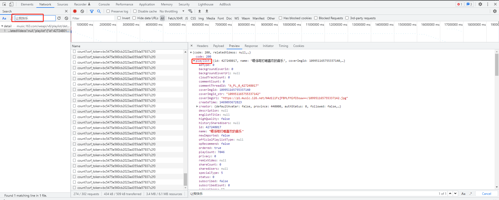
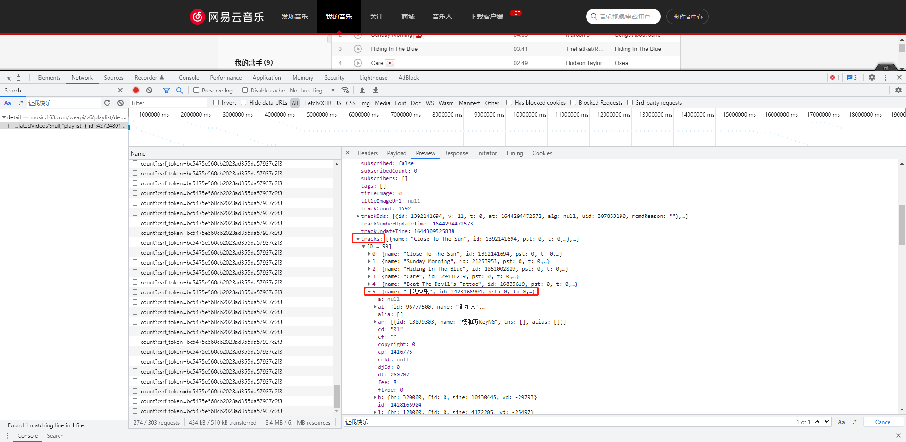
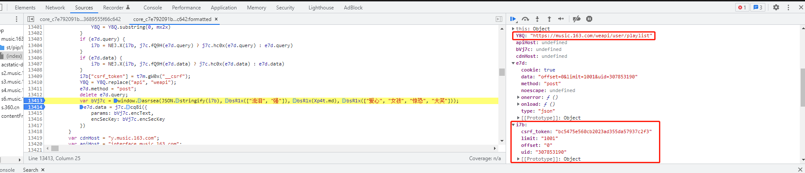
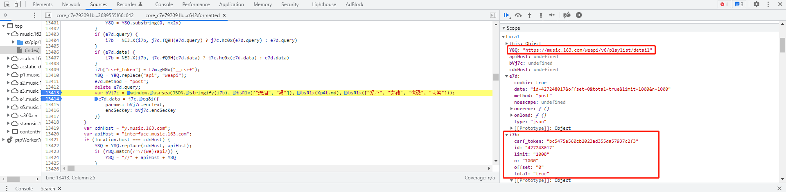
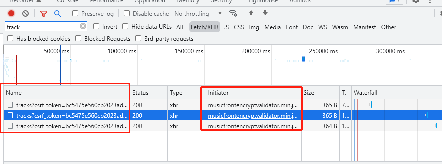
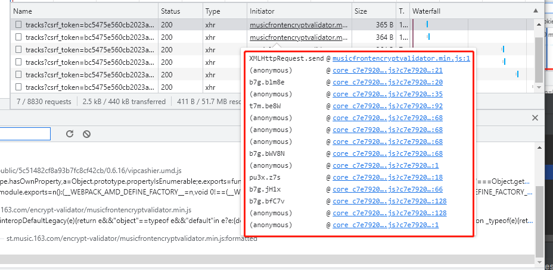
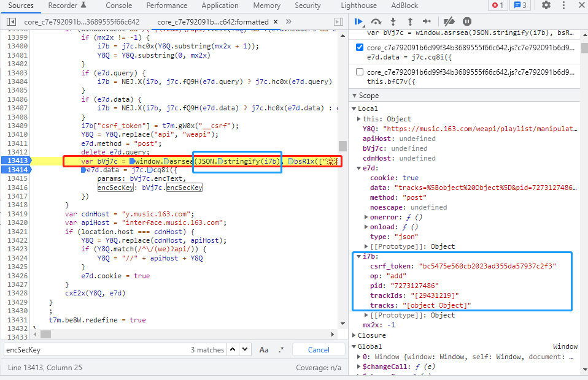

# NeteaseMusic

## 要做一个可以自动按照歌曲的语言将歌单中的歌曲转移到指定歌单的python程序
### 

`一些参数id：
"我喜欢"的歌单id：427248017
华语：7284711237
English：7273127486
日语：7222794221`

查找在歌单中歌曲的id和名称，比如：《让我快乐》，id为1428166904

`Request URL: https://music.163.com/weapi/v6/playlist/detail?csrf_token=bc5475e560cb2023ad355da57937c2f3
params: wFkxchv2mhwCGm9/N9bN99gOnLHsUTspEKuqJHYROVeoawRnkvbuRYL6HjIHoppqBKKbuGCE+wMcn2momKISFhUhIsHamzTFG2Yu4lSjHa78FiKgJvsD3b/yJfdhpfHSlFW+dMNkACBO5yfhbIvdJovxOvYSyWeTBCaNJd8X/0pdV8uwK5HjF9EOvEO5EXzryLWrwRxCTWJaW7lJ3H/qx/qCqLKBbHJ6bZCo3r3o7zc=
encSecKey: 5601f8b904fdf94379598c3bf0ec747c8a4b61ceb82d8c949a58c3f499d54a4a2aa7bf355843bea771a30ffb40a670ca77c4c1cd014032e987d15e16e56cd6ec4335410f75838440746c0f382d622f2f55a2b3ac6ddc2af4267b0448011b7b84f3a4a9d52ce1f7da901427d74306765c599eb90bdb95e3a749af240ddf4d1896`

post的URL：
Y8Q: "https://music.163.com/weapi/user/playlist"

post所需的参数：
`
i7b:
csrf_token: "bc5475e560cb2023ad355da57937c2f3"
limit: "1001"
offset: "0"
uid: "307853190"
`

post的URL：
Y8Q: "https://music.163.com/weapi/v6/playlist/detail"

`i7b:
csrf_token: "bc5475e560cb2023ad355da57937c2f3"
id: "427248017"
limit: "1000"
n: "1000"
offset: "0"
total: "true"`

以Everybody hates me为例：
分享歌曲链接为：https://music.163.com
/song?id=544247523&userid=307853190

歌曲ID为544247523
对应用户的userid为307853190

可以先把A歌单中的歌曲移到B歌单，再选择性地把这首歌从A歌单中删除。

在XHR请求'tracks?csrf_token=bc5475e560cb2023ad355da57937c2f3'完成：

添加成功之后的response：
{
  "trackIds": "[544247523]",
  "code": 200,
  "count": 5,
  "cloudCount": 0
}

应该是通过musicfrontencryptvalidator.min.js这个js文件来生成params和encSecKey参数

通过musicfrontencryptvalidator.min.js文件追溯到一开始生成params和encSecKey参数的是core......文件

其中的i7b文件中op应该是将歌曲添加到歌曲列表中的意思，
csrf_token应该是不变的（在隔天再次访问还是同一个值，不知道会不会随时间改变）
pid是指即将要被分享到的歌单id，
trackids是指所选中的歌曲id

有个'track_playlist-add'的字典，存储要添加歌曲的各种变量