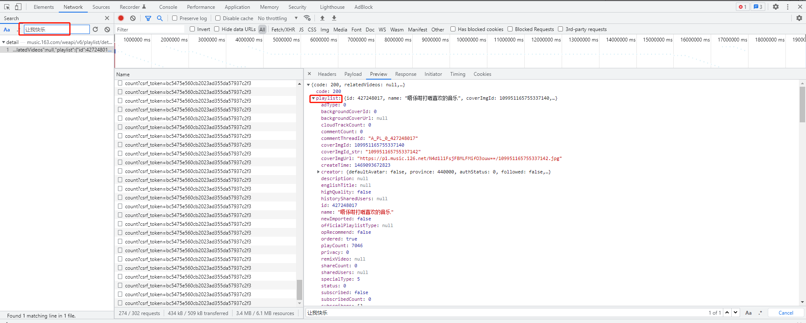
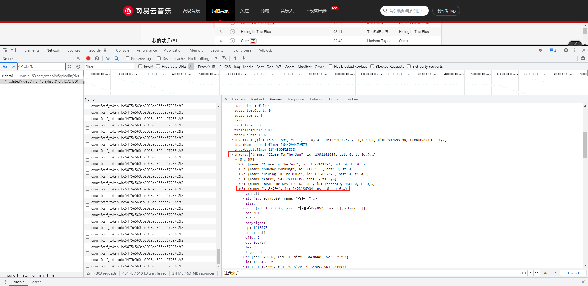
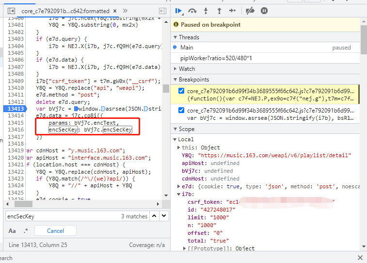
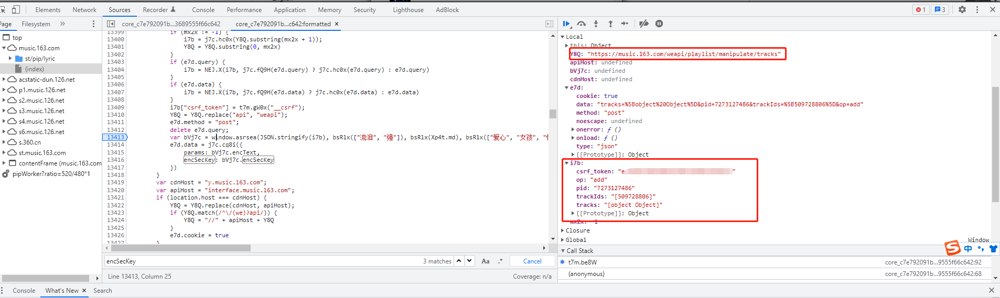
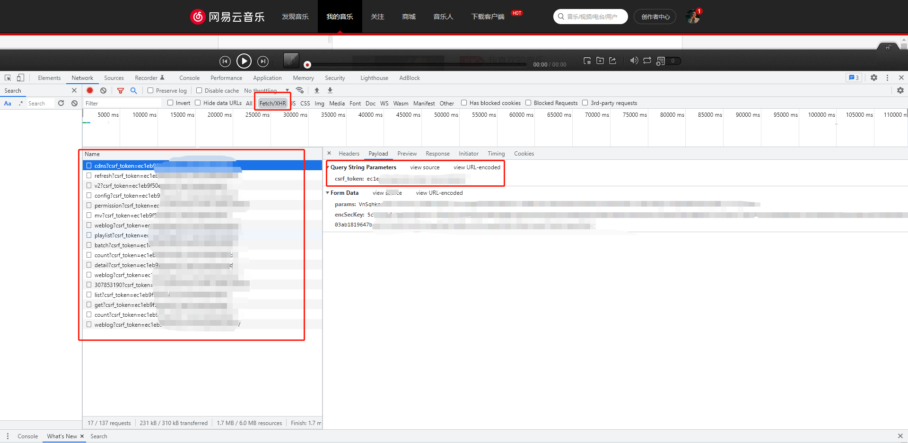
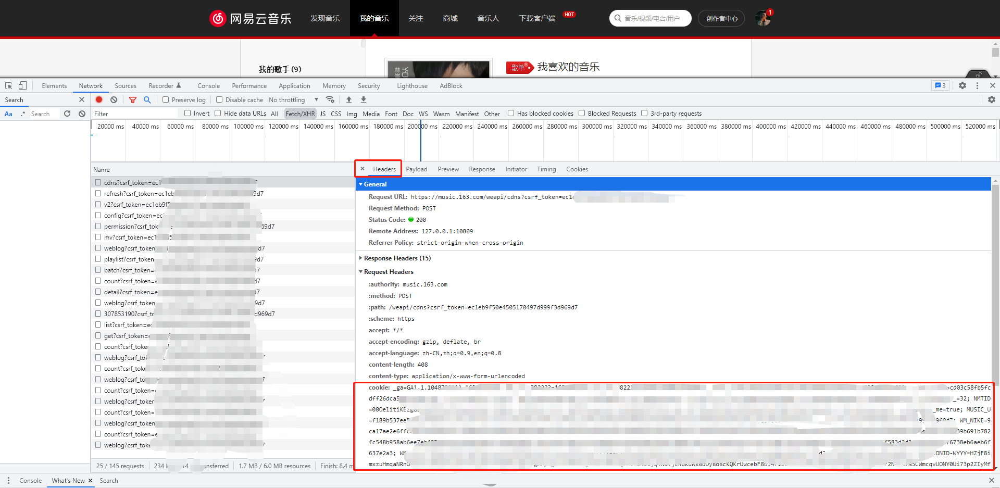

# 网易云音乐 [https://music.163.com/](https://music.163.com/)

* [分析](#分析)
  * [歌单分析](#歌单分析)
  * [调动歌曲分析](#调动分析流程)
* [程序实现](#程序实现)
* [使用方法](#使用方法)
  * [安装](#安装)
  * [修改参数](#修改参数)

# 一个可以按照歌曲的语言自动将歌单中的歌曲转移到指定歌单的python程序

## 程序说明
    这个程序可以将A歌单的歌按照歌曲的语言分类，英文歌会匹配歌手名和歌曲名，中日韩文匹配歌手或者歌曲名，之后按照对应的语言将歌曲添加到用户指定的歌单里。
    比如：在A歌单里面，存在《让我快乐》《Night Changes》，《让我快乐》是一首华语歌，《Night Changes》是英文歌，程序自动将《让我快乐》添加到用户的《华语》歌单里面，
    也可以将《Night Changes》自动匹配添加到《English》里，这里的歌曲和歌单都是用对应的id匹配的。歌曲id和歌单id都可以通过分享的链接查到。


## 分析

### 【1】歌单分析

`一些参数id：`

`"我喜欢"的歌单id：427248017`

`华语：7284711237`

`English：7273127486`

`日语：7222794221`

1. 查找在歌单中歌曲的id和名称，比如：《让我快乐》，id为1428166904
   
   
2. 分析数据包

- 找到调用的api：
  ` https://music.163.com/weapi/v6/playlist/detail?csrf_token=...`
- 向api请求时要传的数据
  ` params: wFkxchv2mhwCGm9/N9bN99gOnLHsUTsp...`
  ` encSecKey: 5601f8b904fdf94379598c3bf0ec7...`


3. 再用同样的方法搜encSecKey，发现params和encSecKey出于core_c7e.....js文件。
   

```js
var bVj7c = window.asrsea(JSON.stringify(i7b), bsR1x(["流泪", "强"]), bsR1x(Xp4t.md), bsR1x(["爱心", "女孩", "惊恐", "大笑"]));
e7d.data = j7c.cq8i({
    params: bVj7c.encText,
    encSecKey: bVj7c.encSecKey
})
```

以上涉及加密操作，感谢[@DAJINZI01](https://github.com/DAJINZI01) 的 [网易云加密算法分析](https://github.com/DAJINZI01/music163com)

可以看出，知道`asrsea`函数是怎么工作的就解决了问题，又因为`window.asrsea = d,`所以看一下`d`函数，
`d`函数又由`a/b/c`函数组成，所以，接下来一次看一下`a/b/c`函数

还能得到`Y8Q`和`i7b`参数的值，不难猜出`Y8Q`就是所要调用的api，`i7b`是我们要向服务器传送的数据，只要向api post`Y8Q`和`i7b`加密后的数据即可。

```
Y8Q: 
    "https://music.163.com/weapi/v6/playlist/detail"
```

```
i7b:
    csrf_token: ""
    id: "427248017"
    limit: "1000"
    n: "1000"
    offset: "0"
    total: "true"
```

### 【2】调动歌曲分析

1. 点击将歌曲添加到某个歌单，可以调试到也是追溯到这一行，说明跟上面的加密操作一样，只需要改变`i7b`和`Y8Q`就可以。
   

```js
Y8Q:"https://music.163.com/weapi/playlist/manipulate/tracks"


i7b:
    csrf_token: ""
op: "add"
pid: "7273127486"
trackIds: "[509728806]"
tracks: "[object Object]"
```

- 其中的i7b文件中op应该是将歌曲添加到歌曲列表中的意思， csrf_token应该是不变的（在隔天再次访问还是同一个值，不知道会不会随时间改变） pid是指目的歌单id， trackids是指所选中的歌曲id

2. 分析添加成功之后的response，trackIds为列表，尝试过一次性加入多首歌曲的id，事实证明可以： {
   "trackIds": "[544247523]",
   "code": 200,
   "count": 5,
   "cloudCount": 0 }

## 程序实现

-
    1. encrypt.py

经过分析可以知道，向服务器传输的数据需要加密操作，加密算法涉及到AES和RSA混合加密，所以借鉴[@DAJINZI01](https://github.com/DAJINZI01)
的[cipher.py](https://github.com/DAJINZI01/music163com) 写了一个encrypt.py，传入我们要向服务器发送的json数据，encrypt.py可以返回
加密之后的params和encSecKey

-
    2. Netease.py

编写一个网易云音乐的类，包含了自定义函数、move_songs、get_tracks_information、cut_songs、df_to_csv

~~~
- 自定义函数   定义token，需要用户自行输入
- move_songs 操作传入的歌单和歌曲，根据参数op决定是添加歌曲还是删除歌曲， 比如要像歌单123中加入为歌曲id为456，789的歌，playlistid就为123，trackids就是[456,789]，op是'add'
- get_tracks_information 根据传入的歌单id参数返回歌单的信息，信息包括歌单名字、歌曲名、歌曲id、歌手名、歌手id、专辑名
- cut_songs 调用move_songs函数实现歌曲的剪切功能
- df_to_csv 将传入的字典用csv存储，以歌单的名称命名
~~~

-
    3. sort_tracks.py

返回歌曲id字典，字典按歌曲语言进行分类，函数中的language（小写）用来存储对应歌曲的语言，并将对应语言保存在新的以`changed_`开头+歌单命名的CSV文件中。 可以匹配`中英日韩文`。

-
    4. playlists.py

调用各个函数的主函数，调用上述函数完成移动歌曲的操作。

## 使用方法

### 环境要求

    需要 Python 3.5+ 环境

### 安装

```
git clone 
cd [NeteaseMusic存放的文件夹]
pip install -r requirements.txt
```

### 修改参数

1. Netease.py
    - 需要把token改成自己的token，将自己token的值取替`自己添加`即可，token可以通过在浏览器按`F12`，选中`Network`的`Fetch/XHR`并刷新页面，将自己的token复制到`Netease.py`
      中的
      ```python
          self.token = '自己添加'  # 用户自己添加
      ```
    - 查看token：
      

    - 复制cookie 定位到`Netease.py`中的代码：
      ```python
      cookie: 自己添加
      ```
      将自己的cookie的值取替`自己添加`即可

    - 查看cookie：
      


2. playlist.py
    - 定位到playlist.py中的以下代码，将参数playlistid改成要转移的源歌单id
    ```python
    result = neteasemusic.get_tracks_information(playlistid='427248017')  # 根据所给的歌单id获取歌单信息
    ```
    - 比如要在歌单`abc`中加入为歌曲id为`456，789`的歌，`playlistid`就为`abc`，`trackids`就是`[456,789]`，`op`是`add`
    - 比如要把歌单`abc`中歌曲id为`456，789`的歌剪切到歌单`edf`， 可以调用cut_songs，`src_playlist`就为`abc`，`des_playlist`就是`edf`，`trackids`
      就是`[456,789]`.
        
修改完参数之后，直接运行playlist.py即可
