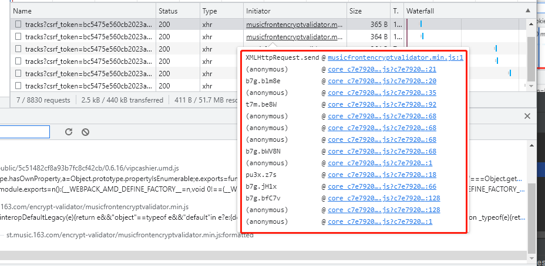
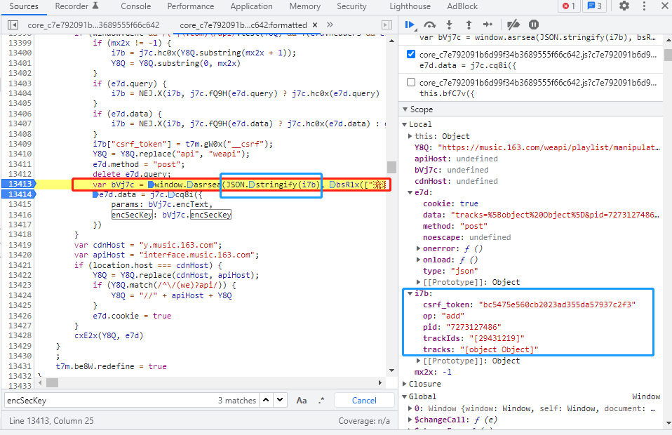

# NeteaseMusic

要做一个可以自动将歌单中的歌曲转移到指定歌单的python程序

以Everybody hates me为例：
分享歌曲链接为：https://music.163.com/song?id=544247523&userid=307853190

歌曲ID为544247523
对应用户的userid为307853190

可以先把A歌单中的歌曲移到B歌单，再选择性地把这首歌从A歌单中删除。

在XHR请求'tracks?csrf_token=bc5475e560cb2023ad355da57937c2f3'完成：

添加成功之后的response：
{
  "trackIds": "[544247523]",
  "code": 200,
  "count": 5,
  "cloudCount": 0
}

应该是通过musicfrontencryptvalidator.min.js这个js文件来生成params和encSecKey参数

通过musicfrontencryptvalidator.min.js文件追溯到一开始生成params和encSecKey参数的是core......文件

其中的i7b文件中op应该是将歌曲添加到歌曲列表中的意思，pid是指即将要被分享到的歌单id，trackids是指所选中的歌曲id
